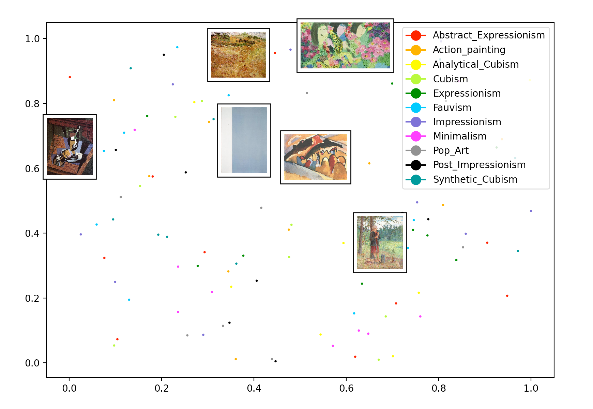

<h3 align="center">Displayinig Corresponding Images by Clicking Data Points</h3>

This python code is written while working on art-data analysis projects. 
The code reads and displays an image corresponding to 2-D data point clicked by users  
By doing so, it helps the users to see the relationship between the images and data points' geometry.  
The example figure below presents 110 two-dimensional data samples with different colors based on their style information.  

<figure>
 
<figcaption>Six example paintings are shown by clicking six arbitrary data points</figcaption>
</figure>
 

<h5> Files</h5>
<ol>
<li> Run: python color_visualization.py
<li> Data embedding (110 random points): embedding_random.npz
<li> Image meta information: example.csv
<li> Images: ./imgs/
<li> User Display Option: painting_hold=True-previous images are hold when new data points are clicked
</ol>